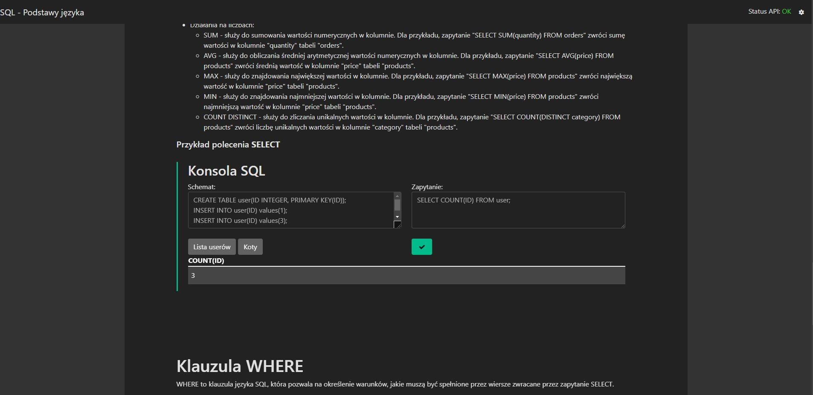
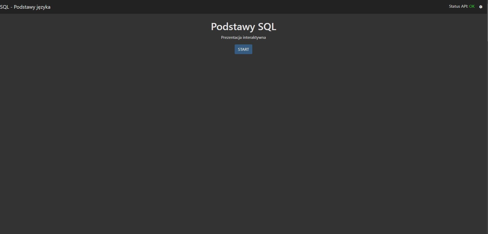

# mithril-sql-presentation

Presentation I made as homework for school about **SQL**.<br>
Introducing interactive console where we can execute real SQL queries.

<br>Besides it's my first ❤ mithril project



## See screenshots
[See screenshots](#screenshots)

## Installation
First clone the repo. 
```shell
git clone https://www.github.com/kacperfaber/mithril-sql-presentation && cd mithril-sql-presentation
```

## App configuration
Setup project
```shell
npm ci
```

## Server configuration
You need API when you want to enable interactive SQL console.
<br>
API is included in the /api directory.
>You don't have to enable API unless you don't want to use interactive console.

#### api-settings.json
Place this file with api.php in the same directory.
```json5
// /api-settings.json
// Place this file at the same directory, where api.php is located
{
    "username": "string",
    "password": "string",
    "port": "number",
    "host": "string",
    "temp_db_name": "string",
  
    // URL when app is running.
    // For example http://localhost:3000
    "cors": "string" 
}
```

#### Everything is done. The last step is to connect with API in application. Click the settings button.

## Run app locally
```shell
npm run run
```


## Screenshots




## Author
Kacper Faber

